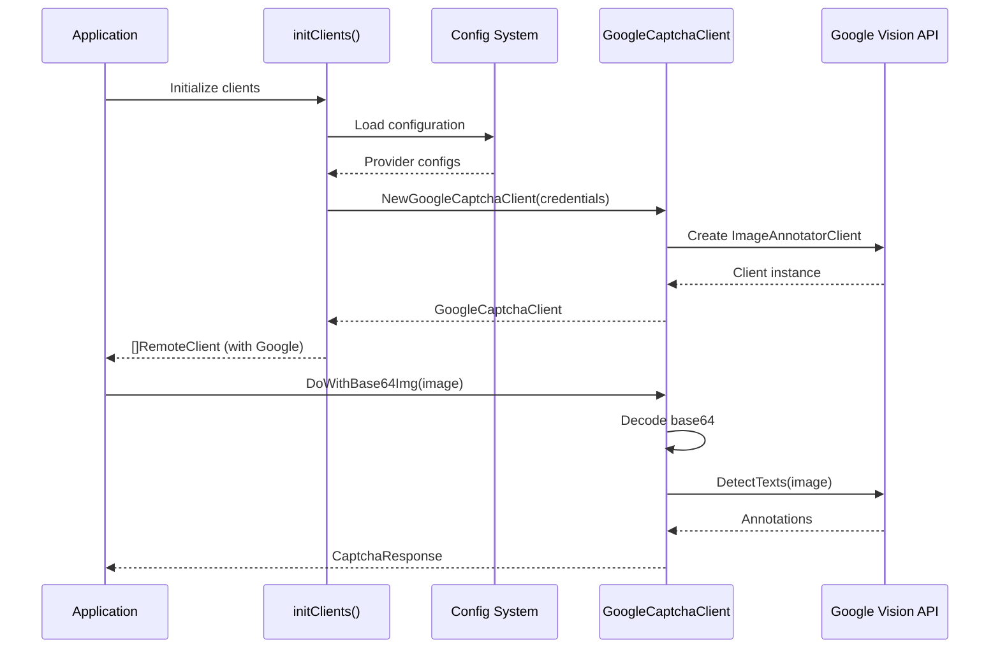

# Design Document: Google OCR Integration

## Overview

This design document describes the integration of Google Cloud Vision API into the existing OCR system. The system already has a partial implementation of the Google OCR client (`internal/captcha/google_captcha.go`) and configuration support, but requires dependency installation, factory integration, and comprehensive testing to be fully operational.

The integration follows the existing pattern established by Alibaba Cloud and Tencent Cloud OCR providers, implementing the `RemoteClient` interface and participating in the load-balanced client pool.

## Architecture

### High-Level Architecture

The Google OCR integration fits into the existing multi-provider OCR architecture:

```
┌─────────────────────────────────────────────────────────────┐
│                     Application Layer                        │
│  (cmd/client, cmd/server, internal/job/getCodeJob.go)       │
└────────────────────┬────────────────────────────────────────┘
                     │
                     ▼
┌─────────────────────────────────────────────────────────────┐
│                  Client Pool (Load Balancer)                 │
│  - Round-robin selection                                     │
│  - Multiple provider support                                 │
└─────┬──────────────┬──────────────┬─────────────────────────┘
      │              │              │
      ▼              ▼              ▼
┌──────────┐  ┌──────────┐  ┌──────────────┐
│   Ali    │  │ Tencent  │  │    Google    │
│  Client  │  │  Client  │  │    Client    │
└──────────┘  └──────────┘  └──────────────┘
      │              │              │
      └──────────────┴──────────────┘
                     │
                     ▼
            RemoteClient Interface
            - DoWithBase64Img()
            - DoWithReader()
```

### Component Interaction



## Components and Interfaces

### 1. GoogleCaptchaClient

**Location:** `internal/captcha/google_captcha.go`

**Purpose:** Implements the `RemoteClient` interface using Google Cloud Vision API for text detection.

**Structure:**
```go
type GoogleCaptchaClient struct {
    client *vision.ImageAnnotatorClient
    ctx    context.Context
}
```

**Methods:**
- `NewGoogleCaptchaClient(credentialsJSON string) (*GoogleCaptchaClient, error)`: Constructor that creates a new client with provided credentials or default credentials from environment
- `DoWithBase64Img(base64Img string) (*CaptchaResponse, error)`: Processes base64-encoded images
- `DoWithReader(r io.Reader) (*CaptchaResponse, error)`: Processes images from io.Reader
- `Close() error`: Closes the Vision API client connection

**Implementation Notes:**
- Uses `cloud.google.com/go/vision/v2/apiv1` for the stable Vision API
- Supports both explicit credentials (JSON string) and default credentials (GOOGLE_APPLICATION_CREDENTIALS env var)
- Strips data URL prefix from base64 strings if present
- Returns the first detected text annotation (which contains all text)
- Returns empty response for images with no detected text

### 2. Client Factory Integration

**Location:** `internal/job/getCodeJob.go` (function `initClients`)

**Purpose:** Initialize all configured captcha providers including Google.

**Current Implementation:**
```go
func initClients() (clients []captcha.RemoteClient, err error) {
    // Ali client initialization
    alicli, err := captcha.NewAliCaptchaClient(...)
    if err == nil {
        clients = append(clients, alicli)
    }
    
    // Tencent client initialization
    tccli, err := captcha.NewTcCaptchaClient(...)
    if err == nil {
        clients = append(clients, tccli)
    }
    
    return clients, nil
}
```

**Required Changes:**
- Add Google client initialization from configuration
- Read credentials from config.Captcha.Providers
- Handle initialization errors gracefully
- Log successful/failed initializations

### 3. Configuration System

**Location:** `internal/config/config.go`

**Current Support:**
The configuration system already supports Google providers:

```go
type CaptchaProvider struct {
    Type            string `yaml:"type"`             // "ali", "tencent", or "google"
    AccessKey       string `yaml:"access_key"`       // For ali/tencent
    SecretKey       string `yaml:"secret_key"`       // For ali/tencent
    CredentialsJSON string `yaml:"credentials_json"` // For google
}
```

**Required Changes:**
- Add environment variable override for `GOOGLE_CREDENTIALS_JSON`
- Ensure validation checks for Google provider credentials

### 4. Load Balancer

**Location:** `internal/job/getCodeJob.go` (method `getClient`)

**Current Implementation:**
```go
func (g *GetCodeJob) getClient() captcha.RemoteClient {
    if len(g.clients) == 0 {
        return nil
    }
    g.shardLock.Lock()
    defer g.shardLock.Unlock()
    
    client := g.clients[g.idx]
    g.idx = (g.idx + 1) % len(g.clients)
    return client
}
```

**No Changes Required:** The existing round-robin implementation automatically includes Google clients once they're added to the pool.

## Data Models

### CaptchaResponse

**Location:** `internal/captcha/api.go`

```go
type CaptchaResponse struct {
    Content string `json:"content"`  // Detected text
    Word    string `json:"word"`     // Reserved for future use
}
```

**Google Vision Mapping:**
- `Content`: Populated with `annotations[0].Description` (full detected text)
- `Word`: Left empty (not used by Google Vision implementation)

### RemoteClient Interface

**Location:** `internal/captcha/api.go`

```go
type RemoteClient interface {
    DoWithBase64Img(base64Img string) (*CaptchaResponse, error)
    DoWithReader(r io.Reader) (*CaptchaResponse, error)
}
```

**Google Implementation:**
- Both methods supported
- `DoWithBase64Img`: Strips data URL prefix, decodes base64, calls `DoWithReader`
- `DoWithReader`: Reads bytes, creates Vision API image, calls `DetectTexts`

## Correctness Properties

*A property is a characteristic or behavior that should hold true across all valid executions of a system—essentially, a formal statement about what the system should do. Properties serve as the bridge between human-readable specifications and machine-verifiable correctness guarantees.*

### Property 1: Valid Configuration Creates Client

*For any* valid Google provider configuration with non-empty credentials_json, creating a GoogleCaptchaClient should succeed and return a non-nil client.

**Validates: Requirements 2.1, 3.3**

### Property 2: Invalid Credentials Produce Errors

*For any* Google provider configuration with invalid or malformed credentials_json, creating a GoogleCaptchaClient should return an error.

**Validates: Requirements 2.2, 3.4, 6.1**

### Property 3: Environment Variables Override YAML

*For any* configuration where both YAML credentials_json and GOOGLE_CREDENTIALS_JSON environment variable are set, the environment variable value should take precedence.

**Validates: Requirements 3.2**

### Property 4: Base64 Decoding Handles Valid Inputs

*For any* valid base64-encoded image string (with or without data URL prefix), DoWithBase64Img should successfully decode and process the image without decoding errors.

**Validates: Requirements 4.1**

### Property 5: Invalid Base64 Returns Decoding Error

*For any* invalid base64 string, DoWithBase64Img should return a decoding error.

**Validates: Requirements 6.3**

### Property 6: Client Pool Includes All Valid Providers

*For any* configuration with multiple valid captcha providers including Google, the initialized client pool should contain clients for all valid providers.

**Validates: Requirements 2.3, 2.4, 7.1**

### Property 7: Load Balancer Rotates Through Clients

*For any* sequence of N requests where N equals the number of clients in the pool, each client should be selected exactly once.

**Validates: Requirements 7.2, 7.3**

### Property 8: Interface Compliance

*For any* GoogleCaptchaClient instance, it should be assignable to the RemoteClient interface and callable through interface methods.

**Validates: Requirements 7.4**

### Property 9: Connection Reuse

*For any* sequence of multiple image processing requests on the same GoogleCaptchaClient instance, the same underlying Vision API client connection should be reused.

**Validates: Requirements 5.3**

### Property 10: API Error Propagation

*For any* error returned by the Google Vision API, the GoogleCaptchaClient should propagate that error to the caller without swallowing it.

**Validates: Requirements 4.4**

## Error Handling

### Error Categories

1. **Initialization Errors**
   - Invalid credentials JSON format
   - Missing credentials
   - Network errors connecting to Google Cloud
   - Authentication failures
   
   **Handling:** Log error, skip Google provider, continue with other providers

2. **Runtime Errors**
   - Base64 decoding failures
   - Image format errors
   - API quota exceeded
   - Network timeouts
   - API service unavailable
   
   **Handling:** Return error to caller, allow retry with different provider

3. **Resource Errors**
   - Client close failures
   - Context cancellation
   
   **Handling:** Log error, attempt cleanup

### Error Logging

All errors should be logged with appropriate context:
- Initialization errors: `logrus.Errorf("Failed to initialize Google OCR client: %v", err)`
- Runtime errors: Propagated to caller for handling
- Resource errors: `logrus.Warnf("Failed to close Google Vision client: %v", err)`

### Graceful Degradation

The system should continue operating even if Google OCR initialization fails:
- Other providers (Ali, Tencent) remain available
- System logs the failure but doesn't crash
- Load balancer works with remaining providers

## Testing Strategy

### Unit Tests

Unit tests verify specific examples and edge cases:

1. **Client Creation Tests**
   - Test with valid credentials JSON
   - Test with empty credentials (should use default)
   - Test with invalid JSON format
   - Test with missing credentials

2. **Image Processing Tests**
   - Test with valid base64 image (with data URL prefix)
   - Test with valid base64 image (without prefix)
   - Test with invalid base64 string
   - Test with empty image
   - Test with io.Reader input

3. **Interface Compliance Tests**
   - Verify GoogleCaptchaClient implements RemoteClient
   - Test both interface methods

4. **Resource Management Tests**
   - Test Close() method
   - Verify context is maintained

### Property-Based Tests

Property-based tests verify universal properties across many generated inputs. Each test should run a minimum of 100 iterations.

**Testing Framework:** Use `github.com/leanovate/gopter` for property-based testing in Go.

**Test Configuration:**
- Minimum 100 iterations per property test
- Each test tagged with: `// Feature: google-ocr-integration, Property N: [property text]`

**Property Test Cases:**

1. **Property 1: Valid Configuration Creates Client**
   - Generate random valid credential JSON structures
   - Verify client creation succeeds
   - Tag: `// Feature: google-ocr-integration, Property 1: Valid Configuration Creates Client`

2. **Property 2: Invalid Credentials Produce Errors**
   - Generate random invalid/malformed JSON strings
   - Verify client creation fails with error
   - Tag: `// Feature: google-ocr-integration, Property 2: Invalid Credentials Produce Errors`

3. **Property 4: Base64 Decoding Handles Valid Inputs**
   - Generate random valid base64 strings (with/without prefix)
   - Verify decoding succeeds without error
   - Tag: `// Feature: google-ocr-integration, Property 4: Base64 Decoding Handles Valid Inputs`

4. **Property 5: Invalid Base64 Returns Decoding Error**
   - Generate random invalid base64 strings
   - Verify decoding error is returned
   - Tag: `// Feature: google-ocr-integration, Property 5: Invalid Base64 Returns Decoding Error`

5. **Property 6: Client Pool Includes All Valid Providers**
   - Generate random provider configurations
   - Verify all valid providers appear in pool
   - Tag: `// Feature: google-ocr-integration, Property 6: Client Pool Includes All Valid Providers`

6. **Property 7: Load Balancer Rotates Through Clients**
   - Generate random client pools
   - Make N requests, verify each client used once
   - Tag: `// Feature: google-ocr-integration, Property 7: Load Balancer Rotates Through Clients`

7. **Property 8: Interface Compliance**
   - Generate random GoogleCaptchaClient instances
   - Verify RemoteClient interface assignment
   - Tag: `// Feature: google-ocr-integration, Property 8: Interface Compliance`

### Integration Tests

Integration tests verify end-to-end functionality with real Google Cloud Vision API:

1. **Real API Tests** (require valid credentials)
   - Test text detection with real images
   - Test with various image formats
   - Verify response format

2. **Configuration Loading Tests**
   - Test YAML configuration loading
   - Test environment variable override
   - Test validation

3. **Factory Integration Tests**
   - Test initClients with Google provider
   - Test multi-provider initialization
   - Test error handling

**Note:** Integration tests should be skippable if credentials are not available (use build tags or environment checks).

### Test Organization

```
internal/captcha/
├── google_captcha.go
├── google_captcha_test.go          # Unit tests
└── google_captcha_property_test.go # Property-based tests

internal/job/
├── getCodeJob.go
└── getCodeJob_test.go              # Factory integration tests

internal/config/
├── config.go
└── config_test.go                  # Configuration tests
```

## Dependencies

### Required Go Modules

Add to `go.mod`:

```go
require (
    cloud.google.com/go/vision/v2 v2.9.6
    google.golang.org/api v0.203.0
)
```

**Version Notes:**
- `cloud.google.com/go/vision/v2`: Latest stable version (v2.9.6 as of January 2025)
- `google.golang.org/api`: Required for authentication options
- These versions are compatible with Go 1.24

### Installation Command

```bash
go get cloud.google.com/go/vision/v2@latest
go get google.golang.org/api@latest
go mod tidy
```

## Deployment Considerations

### Credentials Management

**Option 1: Service Account JSON File**
```yaml
captcha:
  providers:
    - type: "google"
      credentials_json: "${GOOGLE_CREDENTIALS_JSON}"
```

Set environment variable:
```bash
export GOOGLE_CREDENTIALS_JSON='{"type":"service_account","project_id":"...",...}'
```

**Option 2: Default Application Credentials**
```yaml
captcha:
  providers:
    - type: "google"
      credentials_json: ""  # Empty uses default
```

Set environment variable:
```bash
export GOOGLE_APPLICATION_CREDENTIALS="/path/to/service-account-key.json"
```

### Google Cloud Setup

1. Create a Google Cloud project
2. Enable Cloud Vision API
3. Create a service account
4. Download service account key JSON
5. Grant "Cloud Vision API User" role to service account

### Cost Considerations

Google Cloud Vision API pricing (as of 2025):
- First 1,000 units/month: Free
- 1,001 - 5,000,000 units: $1.50 per 1,000 units
- Text detection counts as 1 unit per image

**Recommendation:** Monitor usage and set up billing alerts.

## Security Considerations

1. **Credentials Storage**
   - Never commit credentials to version control
   - Use environment variables or secret management systems
   - Rotate credentials regularly

2. **API Access**
   - Use service accounts with minimal required permissions
   - Enable VPC Service Controls if available
   - Monitor API usage for anomalies

3. **Data Privacy**
   - Images are sent to Google Cloud for processing
   - Ensure compliance with data privacy regulations
   - Consider data residency requirements

## Migration Path

Since the Google OCR implementation already exists but is non-functional:

1. **Phase 1:** Add dependencies (no breaking changes)
2. **Phase 2:** Update factory to initialize Google clients (backward compatible)
3. **Phase 3:** Add comprehensive tests
4. **Phase 4:** Update documentation and deployment guides

Existing deployments without Google credentials will continue working with Ali/Tencent providers only.
